# Modèle de données proposé

## Principes

- Utiliser les conventions Rails 8 : clés primaires entières, `created_at`/`updated_at`, clés étrangères et index explicites.
- Préférer des colonnes de statut lisibles à des booléens multiples.
- Ne jamais utiliser une colonne `type` pour un concept métier : Active Record la réserve à l'héritage STI. Utiliser `kind`, `role` ou `exchange_mode`.
- Stocker les points en entiers et l'argent des missions en centimes.
- Ne prévoir aucune commande, aucun panier et aucun paiement permettant d'acheter des Points Services : ils proviennent exclusivement des échanges et récompenses métier.
- Conserver l'adresse exacte séparément de la localisation publique.
- Utiliser Active Storage pour les fichiers, et non des colonnes de chemin ou de base64.
- Utiliser la suppression logique ou l'anonymisation pour les objets qui participent à un audit.
- Conserver les opérations de points et les journaux d'administration de manière append-only.
- Séparer le score de confiance public, la confiance par catégorie et le risque interne de modération.
- Versionner toute formule de score et conserver les événements ayant produit le résultat.
- Ne jamais déduire une identité vérifiée d'un simple e-mail, téléphone, parrainage ou compte social.
- Conserver un thème et des contenus système immuables reproduisant la maquette ; toute personnalisation ou reset crée une nouvelle version auditée.
- Ne jamais stocker de CSS, JavaScript, SVG ou HTML arbitraire fourni depuis le back-office.

## Vue relationnelle simplifiée

```mermaid
erDiagram
    USER ||--|| PROFILE : possede
    USER ||--o{ LISTING : publie
    CATEGORY ||--o{ LISTING : classe
    CATEGORY o|--o{ CATEGORY : contient
    LISTING ||--o{ SERVICE_REQUEST : recoit
    USER ||--o{ SERVICE_REQUEST : demande
    SERVICE_REQUEST ||--o{ MESSAGE : contient
    SERVICE_REQUEST ||--o{ REVIEW : autorise
    REVIEW ||--|{ REVIEW_RATING : detaille
    USER ||--|| TRUST_PROFILE : possede
    USER ||--o{ TRUST_EVENT : concerne
    USER ||--o{ TRUST_ENDORSEMENT : recoit
    USER ||--o{ TRUST_SCORE_SNAPSHOT : historise
    USER ||--o{ TRUST_APPEAL : conteste
    USER ||--o{ REFERRAL_CODE : cree
    REFERRAL_CODE ||--o{ REFERRAL : attribue
    USER ||--o{ FAVORITE : ajoute
    LISTING ||--o{ FAVORITE : est_favorite
    USER ||--|| POINT_ACCOUNT : possede
    POINT_OPERATION ||--|{ POINT_ENTRY : ecrit
    POINT_ACCOUNT ||--o{ POINT_ENTRY : comptabilise
    USER ||--o{ NOTIFICATION : recoit
    USER ||--o{ REPORT : signale
    LISTING ||--o{ COMMENT : recoit
    USER ||--o{ COMMENT : ecrit
    ACHIEVEMENT ||--o{ ACHIEVEMENT_REWARD : definit
    USER ||--o{ USER_ACHIEVEMENT : progresse
    ACHIEVEMENT ||--o{ USER_ACHIEVEMENT : suit
    USER ||--o{ ORGANIZATION_MEMBERSHIP : rejoint
    ORGANIZATION ||--o{ ORGANIZATION_MEMBERSHIP : regroupe
    ORGANIZATION ||--o{ VOLUNTEER_MISSION : publie
    HELP_CHAIN ||--o{ CHAIN_SERVICE : enchaine
    CHAIN_SERVICE ||--o{ CHAIN_REWARD : distribue
    CHAIN_RULE_VERSION ||--o{ HELP_CHAIN : configure
    USER ||--o{ ARTICLE : redige
    DESIGN_THEME ||--o{ PAGE_VERSION : habille
    PAGE_DEFINITION ||--o{ PAGE_VERSION : versionne
    PAGE_VERSION ||--o{ CONTENT_BLOCK : compose
    PAGE_VERSION ||--o{ SECTION_DECORATION : separe
    MEDIA_ASSET ||--o{ CONTENT_BLOCK : illustre
    USER ||--o{ CONFIGURATION_RESET : declenche
```

Le diagramme reste volontairement lisible. Les relations d'audit, de modération et les relations polymorphes sont détaillées ci-dessous.

## Identité et accès

### `users`

Créé par Devise, puis enrichi avec les champs métier. Les noms définitifs des colonnes d'authentification suivent Devise et sa migration générée.

| Colonne | Type | Rôle |
|---|---|---|
| `email` | string | Identifiant unique normalisé Devise |
| `encrypted_password` | string | Mot de passe haché Devise |
| `role` | string | `member`, `admin`, `super_admin` |
| `status` | string | `pending`, `active`, `suspended`, `anonymized` |
| `confirmed_at` | datetime | Vérification e-mail Devise Confirmable |
| `phone_verified_at` | datetime | Vérification téléphone |
| `last_sign_in_at` | datetime | Sécurité et information utilisateur |
| `suspended_at` | datetime | Suspension |
| `anonymized_at` | datetime | Exercice des droits / fermeture |

Contraintes : e-mail unique insensible à la casse ; rôle et statut contrôlés ; aucun accès authentifié si le compte n'est pas actif.

### `profiles`

| Colonne | Type | Rôle |
|---|---|---|
| `user_id` | reference | Relation unique vers l'utilisateur |
| `first_name`, `last_name` | string | Identité affichée selon politique |
| `public_slug` | string | URL publique stable, unique et non dérivée de l'e-mail |
| `display_name` | string | Pseudonyme ou prénom + initiale affiché publiquement |
| `phone` | string chiffrée | Facultatif |
| `phone_sharing_policy` | string | `per_exchange` ou `nobody`, jamais public par défaut |
| `bio` | text | Présentation |
| `address_line`, `postal_code`, `city`, `country_code` | string chiffrée selon champ | Adresse privée de préremplissage |
| `latitude`, `longitude` | decimal | Géocodage privé si retenu |
| `public_city` | string | Valeur autorisée publiquement |
| `public_profile_status` | string | `draft`, `published`, `restricted`, `anonymized` |
| `level` | string | `bronze`, `silver`, `gold`, si la fonctionnalité est validée |

L'avatar est une pièce jointe Active Storage et son affichage public est un choix explicite. Un membre ayant une annonce publique possède un profil de service consultable ; il peut limiter les champs facultatifs, pas rendre publiques ses coordonnées. Le nom complet, l'e-mail, le téléphone, l'adresse, les coordonnées précises et les signaux internes ne doivent jamais être sérialisés automatiquement dans une vue publique.

### `identities` — authentification sociale

`user_id`, `provider`, `uid`, `email_snapshot`, `token_expires_at`, `revoked_at`. Index unique sur `[provider, uid]`. Google est le premier provider via Devise/OmniAuth. Facebook reste prévu derrière un flag désactivé jusqu'à validation de compatibilité. Ne conserver un access/refresh token chiffré que si une fonctionnalité l'exige réellement ; le simple login ne doit pas devenir un accès durable au compte social.

### `login_sessions`

Devise n'impose pas une table de sessions applicatives. SEOS en ajoute une si la révocation par appareil est retenue : `user_id`, `token_digest`, `ip_digest`, `user_agent_summary`, `last_seen_at`, `expires_at`, `revoked_at`. Conserver les données techniques seulement selon une durée courte documentée et avec un accès limité.

### `admin_permission_grants`

`user_id`, `permission`, `granted_by_id`, `granted_at`, `expires_at`, `revoked_by_id`, `revoked_at`, `reason`. Index unique actif sur `[user_id, permission]`. Seul un utilisateur au rôle admin/super-admin peut recevoir un droit. La révocation conserve la ligne historique.

Les droits servent à restreindre un administrateur, pas à contourner les actions exclusives au super-admin. Une permission comme `users.read` ne donne pas implicitement `users.sensitive_data_reveal`.

## Catalogue et annonces

### `categories`

| Colonne | Type | Rôle |
|---|---|---|
| `name` | string | Libellé |
| `slug` | string | URL stable et unique |
| `parent_id` | integer nullable | Sous-catégorie auto-référente |
| `position` | integer | Ordre d'affichage |
| `active` | boolean | Masquage sans perte historique |

Index unique sur `slug`, index sur `[parent_id, position]`, clé étrangère `parent_id → categories.id`.

### `category_restrictions`

`category_id` nullable, `match_kind`, `pattern`, `restriction_scope`, `status`, `reason_code`, `reason_details`, `starts_at`, `ends_at`, `created_by_id`, `approved_by_id`, `existing_listings_action`, `lock_version`.

Une restriction peut bloquer une catégorie, une sous-catégorie ou un terme contrôlé. `existing_listings_action` vaut `review`, `pause` ou `remove_after_review`, jamais suppression silencieuse. Seuls les admins habilités et le super-admin la gèrent ; toute modification est versionnée/auditée. Les expressions arbitraires dangereuses ne sont pas acceptées : utiliser égalité, préfixe ou motif validé/borné.

### `listings`

| Colonne | Type | Rôle |
|---|---|---|
| `user_id`, `category_id` | references | Propriétaire et classement |
| `slug` | string | URL canonique publique stable et unique |
| `title` | string | Titre public |
| `description` | text | Contenu public modéré |
| `intent` | string | `offer` ou `request` |
| `exchange_mode` | string | `gift`, `barter`, `points` |
| `estimated_points` | integer nullable | Estimation pour le mode points |
| `status` | string | `draft`, `pending_review`, `published`, `paused`, `closed`, `removed` |
| `priority` | string | `standard`, `urgent` |
| `availability` | text | Disponibilités déclarées |
| `service_location_mode` | string | `in_person`, `remote` ou `hybrid` ; distinct du mode d'échange |
| `address_line` | string chiffrée | Adresse exacte privée |
| `postal_code`, `city`, `country_code` | string | Recherche et zone publique |
| `latitude`, `longitude` | decimal | Recherche par rayon, jamais rendue avec précision publiquement |
| `published_at`, `closed_at`, `removed_at` | datetime | Cycle de vie |
| `indexing_status` | string | `pending`, `indexable`, `noindex`, `removed` calculé par policy SEO |
| `seo_lastmod_at` | datetime | Dernier changement public significatif pour sitemap |
| `lock_version` | integer | Verrouillage optimiste recommandé |

Contraintes : `estimated_points > 0` uniquement en mode `points` ; propriétaire différent du demandeur lors d'une demande ; statut et modes contrôlés. Une annonce `in_person` ou `hybrid` doit posséder une zone publique géocodable avant d'être éligible à la carte. Une annonce `remote` ne reçoit jamais de coordonnées factices et ses coordonnées privées éventuelles ne servent pas à produire un marqueur. Photos et vidéo passent par Active Storage avec limites de taille, nombre et type MIME.

L'éligibilité cartographique est une policy calculée et non un booléen librement modifiable : flag `public_map_enabled` actif, annonce publiée, `service_location_mode` dans `in_person/hybrid`, zone publique valide et aucune restriction de confidentialité/modération. Sur la carte globale, toutes les annonces du jeu de résultats sont conservées ; seules les annonces éligibles produisent des marqueurs. Les annonces `remote` sont renvoyées dans un groupe de résultats à distance avec un total dédié.

Canonical, titre SEO, description, Open Graph et JSON-LD sont générés depuis l'annonce et la configuration SEO versionnée. Aucune colonne de JSON-LD libre n'est ajoutée à l'annonce.

### `favorites`

`user_id`, `listing_id`. Index unique `[user_id, listing_id]` pour rendre l'action idempotente.

### `comments`

`listing_id`, `user_id`, `body`, `status`, `parent_id`, `edited_at`, `removed_at`. Le `parent_id` est optionnel si les réponses imbriquées sont retenues. Prévoir modération et suppression logique.

### `top_listing_requests`

`listing_id`, `requester_id`, `status`, `eligibility_reason`, `reviewed_by_id`, `reviewed_at`, `admin_note`, `starts_at`, `ends_at`. Une seule demande active par annonce.

## Demandes, conversations et réputation

### `service_requests`

| Colonne | Type | Rôle |
|---|---|---|
| `listing_id` | reference | Annonce concernée |
| `requester_id` | integer | Membre qui répond |
| `provider_id` | integer | Propriétaire de l'annonce |
| `status` | string | Cycle de la demande |
| `proposed_points` | integer nullable | Proposition initiale |
| `agreed_points` | integer nullable | Montant final |
| `scheduled_at`, `performed_at` | datetime | Exécution |
| `requester_confirmed_at`, `provider_confirmed_at` | datetime | Double confirmation |
| `closed_at`, `cancelled_at`, `disputed_at` | datetime | Sorties |
| `cancellation_reason` | text | Traçabilité |

Statuts proposés : `pending`, `accepted`, `declined`, `scheduled`, `performed`, `awaiting_confirmation`, `completed`, `cancelled`, `disputed`.

### `messages`

`service_request_id`, `sender_id`, `body`, `read_at`, `moderated_at`, `removed_at`. Les pièces jointes éventuelles utilisent Active Storage. Seuls les deux participants et les modérateurs autorisés peuvent lire la conversation.

### `reviews`

`service_request_id`, `author_id`, `reviewee_id`, `category_id`, `completion_answer`, `would_reengage`, `factual_body`, `status`, `submitted_at`, `reveal_at`, `published_at`, `removed_at`, `moderation_reason`.

Index unique `[service_request_id, author_id]`. Création seulement après échange validé. L'avis reste caché à l'autre participant jusqu'au dépôt des deux avis ou l'expiration du délai de réponse. Le texte libre est facultatif, factuel et modérable ; il n'est jamais la seule donnée du calcul.

### `review_ratings`

`review_id`, `review_criterion_id`, `criterion_key_snapshot`, `rating`, `not_applicable`. Critères V1 : `reliability`, `task_quality`, `respect_safety`, `communication`, `punctuality`. Note entière de 1 à 5 ou « non applicable ». Index unique `[review_id, review_criterion_id]`.

Cette table évite un gros JSON difficile à contraindre et autorise des dimensions adaptées à la catégorie. Le formulaire et le calcul sont détaillés dans [`08-systeme-trust-score.md`](./08-systeme-trust-score.md).

### `review_criteria`

`category_id` nullable, `key`, `label`, `help_text`, `dimension`, `evaluator_role`, `position`, `active`, `introduced_in_algorithm_version_id`, `retired_at`. `evaluator_role` distingue les questions posées au demandeur et au prestataire. Un critère utilisé est archivé, jamais renommé ou supprimé sans conserver son libellé historique.

## Confiance, parrainage et prévention des abus

Le Trust Score est une projection recalculable. Les preuves brutes et leur historique restent la source de vérité. Les seuils proposés ci-dessous sont des paramètres versionnés, pas des constantes cachées dans les contrôleurs.

### `trust_profiles`

Une ligne par membre : `user_id`, `public_score`, `public_confidence`, `evidence_count`, `effective_evidence_weight`, `referral_evidence_count`, `referral_effective_weight`, `exchange_effective_weight`, `status`, `algorithm_version_id`, `calculated_at`, `next_recalculation_at`.

`status` : `insufficient_data`, `provisional`, `published`, `under_review`, `restricted`. `provisional` autorise le score parrainé avant le seuil d'échanges, avec la source et l'incertitude visibles. `public_confidence` décrit la solidité statistique de l'estimation, pas la fiabilité morale de la personne.

### `trust_category_scores`

`user_id`, `category_id`, `score`, `confidence`, `evidence_count`, `effective_evidence_weight`, `algorithm_version_id`, `calculated_at`. Index unique `[user_id, category_id, algorithm_version_id]` pour conserver plusieurs versions pendant un recalcul.

### `trust_dimension_scores`

`user_id`, `category_id` nullable, `dimension`, `score`, `confidence`, `evidence_count`, `algorithm_version_id`, `calculated_at`. Dimensions proposées : fiabilité, qualité liée à la tâche, respect/sécurité, communication et ponctualité. Quêtes, niveaux et solde de points restent hors calcul.

### `trust_events` — append-only

`subject_id`, `actor_id` nullable, `service_request_id` nullable, `category_id` nullable, `event_kind`, `dimension`, `normalized_value`, `base_weight`, `occurred_at`, `source_type`, `source_id`, `validity_status`, `invalidated_by_id`, `invalidated_at`, `invalidation_reason`, `metadata` minimale.

Exemples : service confirmé, annulation imputable après médiation, avis structuré, parrainage confirmé, signalement confirmé, recours accepté. Une correction invalide l'événement avec un motif ; elle ne détruit pas la ligne. Index d'idempotence unique sur la source métier pertinente.

### `trust_endorsements`

`endorser_id`, `endorsed_id`, `category_id` nullable, `kind`, `relationship_context`, `status`, `independent_exchanges_required`, `activated_at`, `expires_at`, `revoked_at`. `kind` : `skill_endorsement`, `worked_together`. Les codes d'inscription utilisent les tables `referral_*` séparées.

Une recommandation est plafonnée, provisoire, expirante et ne remplace jamais un échange confirmé. Interdire l'auto-recommandation, les doublons de paire et les cycles directs utilisés pour fabriquer artificiellement un score.

### `referral_codes` et `referrals`

- `referral_codes` : `owner_id`, `code_digest`, `status`, `expires_at`, `claimed_at` ; code aléatoire à usage unique, affiché en clair seulement au propriétaire au moment de sa création.
- `referrals` : `referral_code_id`, `referrer_id`, `referred_user_id`, `position`, `primary_referrer`, `status`, `trust_weight`, `claimed_at`, `objection_deadline_at`, `confirmed_at`, `qualified_at`, `rewarded_at`, `invalidated_at`, `invalidation_reason`, `risk_review_status`.

Contraintes :

- index unique sur `referral_code_id` ;
- index unique `[referrer_id, referred_user_id]` ;
- index unique `[referred_user_id, position]`, avec `position BETWEEN 1 AND 10` ;
- une seule ligne `primary_referrer = true` par nouveau membre ;
- au plus dix parrainages, contrôlés dans une transaction verrouillant le compte ;
- `trust_weight = 0.25` pour chaque soutien confirmé dans la version V1 ;
- un code n'est accepté que pendant les sept premiers jours du compte ;
- seul le parrain principal peut déclencher l'éventuelle récompense de quête après qualification.

La qualification exige : e-mail du nouveau membre vérifié, 30 jours d'ancienneté et deux échanges confirmés avec deux utilisateurs absents de ses parrains. Elle peut créditer `15 PS` au parrain principal une seule fois dans la vie de sa quête ; tous les autres parrainages restent des preuves Trust sans récompense.

Le nouveau membre reçoit immédiatement l'effet provisoire d'un code valide, mais aucun Point Service et aucun droit supplémentaire. Après 72 heures sans objection du parrain, le soutien est confirmé. Une invalidation conserve la ligne et produit un recalcul du score.

Statuts proposés : `provisional`, `confirmed`, `qualified`, `objected`, `invalidated`. `qualified` ajoute seulement l'éligibilité éventuelle du parrain principal à une récompense ; le poids Trust reste `0.25`.

### `trust_algorithm_versions`

`version`, `status`, `configuration`, `explanation`, `approved_by_id`, `approved_at`, `activated_at`, `retired_at`. La configuration décrit poids, plafonds, décroissance temporelle, seuils de publication et règle de confiance. Toute activation est réservée au super-admin, exige simulation préalable et audit.

### `trust_score_snapshots` — append-only

`user_id`, `category_id` nullable, `algorithm_version_id`, `score`, `confidence`, `evidence_count`, `dimension_values`, `reason`, `calculated_at`. Sert à expliquer une évolution, comparer deux versions et traiter une contestation.

### `trust_risk_assessments` — strictement interne

`user_id`, `service_request_id` nullable, `risk_level`, `signals`, `status`, `reviewed_by_id`, `reviewed_at`, `expires_at`. Les signaux sont minimisés et expliqués : comptes reliés, volume anormal, réciprocité, répétition d'une paire, vitesse d'activité, appareil partagé avec incertitude.

Cette table n'alimente pas directement l'affichage public et ne constitue pas une preuve de fraude. Une mesure ayant un effet important exige une revue humaine. L'accès est limité à la cellule habilitée et journalisé.

### `trust_appeals`

`user_id`, `trust_score_snapshot_id`, `kind`, `statement`, `status`, `assigned_to_id`, `decision`, `decided_at`, `response_due_at`. Le membre peut obtenir l'explication de ses principales contributions, signaler une erreur et demander une revue humaine.

### `notifications`

`user_id`, `kind`, `notifiable_type`, `notifiable_id`, `title`, `body`, `read_at`, `emailed_at`. Index sur `[user_id, read_at, created_at]`. Une notification est une projection utilisateur, pas la source de vérité de l'action métier.

### `reports`

`reporter_id`, `reportable_type`, `reportable_id`, `reason`, `details`, `status`, `assigned_to_id`, `resolved_at`, `resolution`, `due_at`. Les cibles possibles incluent annonce, commentaire, message ou profil.

## Portefeuille et registre des Points Services

Le champ `users.points_balance` seul serait simple mais insuffisant pour l'audit demandé. Le modèle recommandé est un petit registre en partie double.

### `point_accounts`

`user_id` nullable, `kind`, `balance`, `status`. Une ligne `kind = user` unique par membre et au moins une ligne `kind = system` sans utilisateur pour les émissions et retraits de bonus. La contrainte de présence de `user_id` dépend donc du `kind`.

### `point_operations`

`kind`, `status`, `initiator_id`, `source_type`, `source_id`, `idempotency_key`, `reason`, `committed_at`, `reversed_operation_id`.

Kinds : `signup_bonus`, `service_transfer`, `achievement_reward`, `chain_reward`, `admin_adjustment`, `reversal`.

### `point_entries`

`point_operation_id`, `point_account_id`, `amount`, `balance_after`. Une opération validée possède au moins deux écritures dont la somme est nulle, en incluant le compte système lors d'une émission ou expiration.

Contraintes essentielles :

- index unique sur `point_operations.idempotency_key` ;
- index unique sur `[point_operation_id, point_account_id]` si une seule écriture par compte ;
- somme des écritures égale à zéro avant passage à `committed` ;
- verrouillage des comptes dans une transaction de base ;
- aucune mise à jour/destruction des écritures validées ;
- correction par opération inverse liée.

### `point_valuation_versions` et `point_valuation_brackets`

La correspondance **strictement indicative** euros → Points Services est administrable sans recoder. La version contient `name`, `status`, `effective_at`, `created_by_id`, `approved_by_id`, `published_at`, `superseded_at`, `lock_version`. Les tranches contiennent `points_from`, `points_to`, `euros_from_cents`, `euros_to_cents`, `position` et un index unique par version/position.

Une seule version est active. Elle sert aux textes d'aide et estimations, jamais à acheter, vendre, rembourser ou convertir des PS. Publication après simulation ; non-rétroactivité par défaut ; ancienne version conservée avec les opérations historiques.

### `engagement_rule_versions`

`name`, `status`, `exchange_cycle_size`, `bronze_reward_points`, `silver_reward_points`, `gold_reward_points`, `per_period_cap`, `effective_at`, `created_by_id`, `approved_by_id`, `published_at`, `superseded_at`, `lock_version`.

Cette version pilote le bonus après N échanges et les barèmes Bronze/Argent/Gold. Les bornes système interdisent montant négatif, fréquence nulle ou émission non simulée. Une progression commencée conserve la règle référencée, sauf migration explicite auditée.

## Quêtes, succès et niveaux

### `achievements`

`name`, `slug`, `description`, `event_name`, `target_count`, `recurrence`, `requires_proof`, `requires_review`, `active`, `position`.

`recurrence` : `once`, `monthly`, `cycle`. Les exemples de maquette sont publication, témoignage écrit/vidéo, partage mensuel, réponses, parrainage et série d'échanges.

### `achievement_rewards`

`achievement_id`, `engagement_rule_version_id`, `level`, `points`. Index unique `[achievement_id, engagement_rule_version_id, level]`. Permet de représenter les récompenses Bronze/Argent/Gold sans JSON opaque et de préserver le barème réellement appliqué.

### `user_achievements`

`user_id`, `achievement_id`, `status`, `progress`, `period_key`, `submitted_at`, `reviewed_by_id`, `reviewed_at`, `completed_at`, `rewarded_at`. Index unique `[user_id, achievement_id, period_key]` pour empêcher un double gain mensuel. Les preuves utilisent Active Storage.

## Chaînes d'entraide

### `help_chains`

`creator_id`, `chain_rule_version_id`, `name`, `slug`, `status`, `started_at`, `closed_at`. Le slug public ne doit pas servir de secret de validation. Une chaîne n'est pas fermée parce qu'elle dépasse dix maillons : seule la règle versionnée ou une action métier explicite peut la terminer.

### `chain_rule_versions`

`name`, `status`, `length_mode`, `max_links`, `reward_scope`, `rewarded_previous_links`, `points_per_validation`, `max_points_per_link`, `max_points_per_member`, `effective_at`, `created_by_id`, `approved_by_id`, `published_at`, `superseded_at`, `lock_version`.

`length_mode` vaut `unlimited` par défaut ou `limited`; `max_links` est requis uniquement dans le second cas. `reward_scope` est une valeur allowlistée (`provider_only`, `last_n_eligible`, éventuellement `all_eligible` si la simulation l'autorise). La publication affiche l'émission maximale par validation et sur les scénarios de charge ; aucune formule exécutable libre n'est stockée.

### `chain_services`

`help_chain_id`, `provider_id`, `beneficiary_id` nullable, `position`, `description`, `recipient_contact_ciphertext`, `invitation_token_digest`, `invitation_expires_at`, `status`, `confirmed_at`, `confirmed_ip_digest`.

Statuts : `draft`, `invited`, `confirmed`, `expired`, `disputed`, `cancelled`. Index unique sur le condensat de jeton et sur `[help_chain_id, position]`.

### `chain_rewards`

`chain_service_id`, `recipient_id`, `chain_rule_version_id`, `points`, `reward_rank`, `point_operation_id`. Index unique `[chain_service_id, recipient_id]`. Les plafonds se calculent depuis la version de règle référencée et les récompenses validées, jamais depuis l'interface.

## Organisations et Voyage solidaire

### `organizations`

`name`, `slug`, `kind`, `legal_name`, `registration_number`, `country_code`, `website`, `description`, `public_location`, `status`, `public_profile_status`, `verified_at`, `verified_by_id`. Kinds : `association`, `company`, `institution`, `collective`. Statuts : `pending`, `verified`, `rejected`, `suspended`.

### `organization_memberships`

`organization_id`, `user_id`, `role`, `status`. Rôles : `owner`, `manager`, `editor`. Index unique `[organization_id, user_id]`.

### `partnerships`

`organization_id`, `kind`, `status`, `public_title`, `public_description`, `starts_on`, `ends_on`, `position`, `approved_by_id`, `approved_at`, `removed_at`. Kinds : `institutional`, `operational`, `technical`, `support`. Le logo utilise Active Storage.

Un partenariat ouvre une page publique et éventuellement des droits explicitement accordés dans l'espace organisation. Il ne donne jamais accès aux profils privés, messages, exports membres ou outils de modération. Une association peut également être partenaire sans changer de type d'organisation.

### `volunteer_missions`

`organization_id`, `title`, `description`, `country_code`, `region`, `private_address`, `public_location`, `starts_on`, `ends_on`, `minimum_stay_days`, `help_hours_per_day`, `days_off_per_week`, `languages`, `daily_contribution_cents`, `volunteer_capacity`, `accommodation`, `meals`, `status`, `published_at`, `removed_at`.

Contrainte : `daily_contribution_cents BETWEEN 0 AND 1500`. Photos via Active Storage. Suppression logique si candidatures ou audits existent.

### `mission_applications` — recommandé si une candidature est prévue

`volunteer_mission_id`, `user_id`, `message`, `status`, `submitted_at`, `decided_at`. Cette table n'est pas visible dans la maquette mais évite de détourner la messagerie des échanges locaux.

## Journal de bord, témoignages et contenus administrables

### `articles`

`author_id`, `title`, `slug`, `summary`, `status`, `published_at`. Le contenu riche utilise Action Text et l'image principale Active Storage. Index unique sur `slug`. Statuts : `draft`, `scheduled`, `published`, `archived`.

### `testimonials`

`user_id` nullable, `kind`, `quote`, `status`, `submitted_at`, `reviewed_by_id`, `reviewed_at`, `published_at`, `removed_at`, `display_name_snapshot`, `public_location_snapshot`, `publication_consent_version`, `publication_consented_at`. `kind` : `written`, `video`. La vidéo utilise Active Storage ; l'accord de publication est séparé et versionné. Un témoignage n'est pas un avis et n'influence pas le Trust Score.

### `design_themes`

`name`, `version`, `status`, `tokens`, `system_default`, `parent_theme_id`, `created_by_id`, `validated_by_id`, `validated_at`, `published_at`, `archived_at`, `lock_version`. Statuts : `draft`, `validated`, `published`, `archived`.

`tokens` est un JSON validé par un schéma strict : uniquement couleurs, polices approuvées, tailles bornées, espacements, rayons, ombres, gradients et presets de mouvement. Une seule version est publiée. La ligne `system_default = true` est immuable et ne possède aucune action update/destroy.

### `page_definitions`

`key`, `route_key`, `template_key`, `schema_version`, `active`, `system_defined`. Cette table référence les pages/slots disponibles mais ne crée pas de routes arbitraires. Les définitions système sont synchronisées depuis le code et ne sont pas supprimables depuis l'administration.

### `page_versions`

`page_definition_id`, `design_theme_id` nullable, `locale`, `version`, `status`, `created_by_id`, `validated_by_id`, `validated_at`, `published_at`, `archived_at`, `system_default`, `lock_version`. Index unique `[page_definition_id, locale, version]` et une seule version publiée par page/locale.

### `content_blocks`

`page_version_id`, `slot_key`, `kind`, `title`, `subtitle`, `eyebrow`, `body`, `cta_label`, `cta_url`, `cta_style`, `layout_preset`, `surface_token`, `position`, `visible`, `starts_at`, `ends_at`, `media_asset_id`, `seo_title`, `seo_description`.

Les blocs pilotent descriptions, CTA, médias, ordre et variantes prévues. Le couple `[page_version_id, slot_key, position]` est unique. Les contenus riches sont nettoyés ; aucune balise script/style, URL dangereuse ou attribut événementiel n'est accepté.

### `media_assets`

`name`, `kind`, `alt_text`, `credit`, `license`, `source_url`, `focal_x`, `focal_y`, `status`, `uploaded_by_id`, `archived_at`. Le fichier utilise Active Storage. `kind` : image, vidéo, logo, illustration. Une purge physique n'est possible qu'après vérification de toutes les versions qui le référencent.

### `section_decorations`

`page_version_id`, `after_slot_key`, `preset_key`, `animation_key`, `foreground_token`, `background_token`, `desktop_height`, `mobile_height`, `flip_horizontal`, `flip_vertical`, `variant_seed`, `enabled`, `position`.

Les presets et animations sont une allowlist livrée dans le code. Contraintes sur les hauteurs, clés de couleur et vitesses ; unicité de position entre deux slots. Les décors sont `aria-hidden`, réservent leur hauteur et possèdent toujours un rendu statique reduced-motion.

### `feature_flags`

`key`, `enabled`, `default_enabled`, `configuration`, `description`, `updated_by_id`, `updated_at`, `lock_version`. `public_map_enabled` vaut `true` par défaut ; `financial_support_enabled` et `facebook_login_enabled` valent `false`. La clé est système et non créable librement. Toute modification produit un audit et une version de configuration.

### `configuration_resets`

`actor_id`, `target_type`, `target_id`, `scope`, `from_version`, `to_version`, `reason`, `snapshot`, `created_at`. Table append-only. Scopes : token, groupe, composant, bloc, média, séparateur, page, thème, site. Le snapshot contient des identifiants/valeurs de configuration minimisés, jamais des données utilisateurs.

### `legal_document_versions`

`kind`, `version`, `status`, `summary_of_changes`, `effective_at`, `published_at`, `author_id`. Le contenu utilise Action Text. Index unique `[kind, version]`. Une version publiée est immuable ; une correction crée une nouvelle version.

### `newsletter_subscriptions`

`user_id` nullable, `email` chiffrée, `status`, `consent_version`, `consented_at`, `source`, `confirmed_at`, `unsubscribed_at`. Le consentement à la newsletter est séparé de l'acceptation des CGU et son retrait est conservé au niveau probatoire strictement nécessaire.

### `contact_requests`

`user_id` nullable, `email` chiffrée, `subject_kind`, `message` chiffré, `status`, `assigned_to_id`, `submitted_at`, `resolved_at`, `retention_due_at`, `ip_digest`, `spam_score`.

Le formulaire Contact est le seul canal applicatif ouvert à un visiteur. Il écrit à l'équipe SEOS, jamais à l'auteur d'une annonce. Limitation de débit, anti-robot, notice de confidentialité et purge sont obligatoires ; aucune conversation d'annonce n'est créée.

### `seo_configuration_versions`

`name`, `status`, `site_name`, `canonical_host`, `default_title_template`, `default_description`, `organization_payload`, `indexability_rules`, `crawler_policy`, `created_by_id`, `approved_by_id`, `published_at`, `superseded_at`, `lock_version`.

Les JSON éventuels sont validés par un schéma fermé : types Schema.org, règles de pages et crawlers allowlistés. Aucun script ou JSON-LD libre. Une seule version publiée alimente canonical, robots, sitemaps et graphes JSON-LD. Les secrets Search Console n'appartiennent pas à cette table.

## Conformité et administration

### `cookie_consents`

`user_id` nullable, `visitor_token_digest`, `version`, `necessary`, `analytics`, `external_media`, `decided_at`, `expires_at`. Ne pas stocker davantage d'identification qu'il n'en faut.

### `data_requests`

`user_id`, `kind`, `status`, `details`, `verified_at`, `assigned_to_id`, `completed_at`, `response_due_at`. Kinds : accès, portabilité, rectification, effacement, limitation, opposition, retrait.

### `retention_policy_versions`

`name`, `status`, `rules`, `effective_at`, `created_by_id`, `approved_by_id`, `published_at`, `superseded_at`, `legal_reviewed_at`, `lock_version`. Chaque règle contient catégorie, finalité, déclencheur, durée active bornée, archivage intermédiaire, méthode de sortie et exception légale.

Une valeur `forever` globale est interdite. Une durée indéfinie n'est admise que pour une donnée réellement anonymisée ou une obligation d'archivage légal documentée hors base active. La publication reste super-admin mais nécessite validation juridique/DPO et simulation des données affectées.

### `financial_contributions` et `payment_events` — dormant

`financial_contributions` : `supporter_id` nullable, `amount_cents`, `currency`, `status`, `stripe_checkout_session_id`, `stripe_payment_intent_id`, `email_receipt_requested`, `completed_at`, `refunded_at`.

`payment_events` : `provider`, `external_event_id`, `kind`, `payload_digest`, `status`, `processed_at`, `error_code`. Index unique sur `external_event_id` pour l'idempotence des webhooks.

Ces tables ne sont utilisées que si `financial_support_enabled` est activé après validation. Une contribution est un soutien/don sans achat, droit, PS, niveau, Trust Score ni avantage de visibilité. Les données Stripe restent minimales ; aucune donnée carte n'entre dans SEOS. Ne jamais émettre de reçu fiscal sans habilitation confirmée.

### `audit_logs`

`actor_id`, `action`, `auditable_type`, `auditable_id`, `metadata`, `request_id`, `ip_digest`, `created_at`. Pas de `updated_at` nécessaire si la table est strictement append-only.

### `sensitive_data_access_logs`

`actor_id`, `subject_user_id`, `resource_type`, `resource_id`, `field_group`, `reason`, `request_id`, `accessed_at`. Une révélation de téléphone, e-mail, adresse, conversation ou pièce sensible produit une ligne append-only. Les valeurs consultées ne sont pas recopiées dans le journal.

### `moderation_actions`

`actor_id`, `target_type`, `target_id`, `kind`, `reason_code`, `reason_details`, `previous_status`, `new_status`, `expires_at`, `reversed_action_id`, `created_at`. Suspendre, masquer, restaurer et lever une mesure sont des actions séparées et auditables.

### `site_settings`

`key`, `value`, `value_type`, `updated_by_id`. Exemples : pays couverts et limites globales non sensibles. Index unique sur `key`. Les secrets n'appartiennent jamais à cette table. Les activations fonctionnelles utilisent `feature_flags`.

Les paramètres sensibles au calcul, aux points ou à la conservation ne sont pas de simples clés éditables : ils utilisent respectivement versions d'algorithme, barèmes versionnés et politiques validées.

## Index indispensables

- Toutes les clés étrangères.
- `users.email` unique après normalisation.
- `listings.status`, `[status, published_at]`, `[category_id, status]`, `[service_location_mode, status]`, `[city, status]` et coordonnées si recherche par rayon.
- `listings.slug` unique, `[indexing_status, seo_lastmod_at]` pour sitemap ; `category_restrictions` par statut/portée/période.
- `service_requests` sur chaque participant et `[listing_id, status]`.
- `messages` sur `[service_request_id, created_at]` et `[sender_id, read_at]`.
- `notifications` sur `[user_id, read_at, created_at]`.
- `point_entries` sur `[point_account_id, created_at]`.
- versions de barèmes par `[status, effective_at]`, tranches de valorisation uniques par version/position et une seule version publiée de chaque famille.
- Unicités métier citées pour favoris, avis, récompenses, adhésions et périodes de quête.
- `trust_events` sur `[subject_id, occurred_at]`, `[source_type, source_id]` et `[service_request_id, event_kind]` selon les cardinalités.
- `trust_category_scores` et `trust_dimension_scores` sur le membre, la catégorie/dimension et la version d'algorithme.
- `trust_score_snapshots` sur `[user_id, calculated_at]` et `trust_appeals` sur `[status, response_due_at]`.
- `referrals` unique par code, paire parrain/membre et position 1–10 ; un seul parrain principal par membre.
- `audit_logs` sur `[auditable_type, auditable_id, created_at]` et `[actor_id, created_at]`.
- `sensitive_data_access_logs` sur `[subject_user_id, accessed_at]` et `[actor_id, accessed_at]`.
- `admin_permission_grants` sur l'administrateur, la permission et les dates d'activation/révocation.
- `legal_document_versions` unique par type/version.
- `design_themes` unique par version, une seule ligne système par défaut et une seule version publiée.
- `page_versions` unique par page/locale/version, index publié et verrouillage optimiste.
- `content_blocks` sur `[page_version_id, slot_key, position]`, `section_decorations` sur la page et la position.
- `feature_flags.key` unique ; `configuration_resets` sur `[target_type, target_id, created_at]` et `[actor_id, created_at]`.
- `seo_configuration_versions` et `retention_policy_versions` sur `[status, effective_at/published_at]` ; une seule version active de chaque type.
- `contact_requests` sur `[status, submitted_at]` et `retention_due_at` ; `payment_events.external_event_id` unique.
- `organizations.slug` unique, `partnerships` sur `[status, position]` et `[organization_id, status]`.

## Active Storage et traitements asynchrones

Pièces jointes prévues : avatar, médiathèque du Studio, médias d'annonce, preuves de quêtes, médias d'article et photos de mission. Les validations doivent vérifier nombre, taille, type MIME réel et dimensions. Les variantes d'images, notifications e-mail et éventuelles analyses antivirus passent par Active Job/Solid Queue.

## SQLite et évolution

SQLite convient au lancement du squelette actuel. Pour une recherche géographique initiale, stocker latitude/longitude et interroger une boîte englobante avant de calculer la distance suffit à petite échelle. Si le catalogue devient important ou nécessite des requêtes géospatiales avancées, une migration vers PostgreSQL/PostGIS pourra être préparée sans changer le modèle public de localisation.

## Données de démonstration minimales

- rôles : un membre, un membre Association, un admin, un super-admin ;
- catégories et sous-catégories visibles dans la maquette ;
- annonces représentant les trois modes et les deux intentions ;
- demandes dans chaque statut important ;
- un portefeuille avec récompense de quête d'accueil, transfert et correction ;
- avis vérifié, favori, commentaire et signalement ;
- profil de confiance sans assez de données, profil publié et score par catégorie ;
- avis structurés complets/partiels, paire récurrente plafonnée et membre avec 0, 1, 5 puis 10 parrainages ;
- code à usage unique réutilisé/refusé, onzième code bloqué, parrainage principal qualifié et soutien invalidé ;
- version active et version candidate du calcul, snapshots avant/après et contestation ;
- signal de risque interne revu puis confirmé/infirmé par un humain ;
- quêtes ponctuelle, mensuelle et avec preuve ;
- chaînes illimitée et limitée, profondeurs de récompense différentes, gains/plafonds différents et configuration rejetée pour émission non bornée ;
- organisation en attente et organisation vérifiée ;
- association avec mission, partenaire actif/expiré et organisation possédant les deux relations ;
- mission à 0 €, 10 € et 15 € par jour ;
- article brouillon et article publié.
- témoignage écrit/vidéo en attente et publié, bloc d'accueil planifié, deux versions d'une page légale ;
- thème système immuable, thème brouillon/publié, page par défaut/personnalisée et reset page/thème/site ;
- chaque preset de séparateur en statique/animé, plus le flag carte activé puis désactivé ;
- annonces `in_person`, `remote` et `hybrid`, carte détaillée autorisée/interdite, carte globale avec marqueurs physiques et groupe distant ;
- annonce offre/demande indexable, annonce `noindex`, canonical, sitemap et graphes Schema.org sans donnée privée ;
- restriction de catégorie active/planifiée, version de valorisation PS, version de bonus/niveaux et version de conservation ;
- demande Contact visiteur sans conversation d'annonce ; soutien Stripe dormant et événement webhook rejoué ;
- administrateur à droits limités, permission expirée et super-admin.
